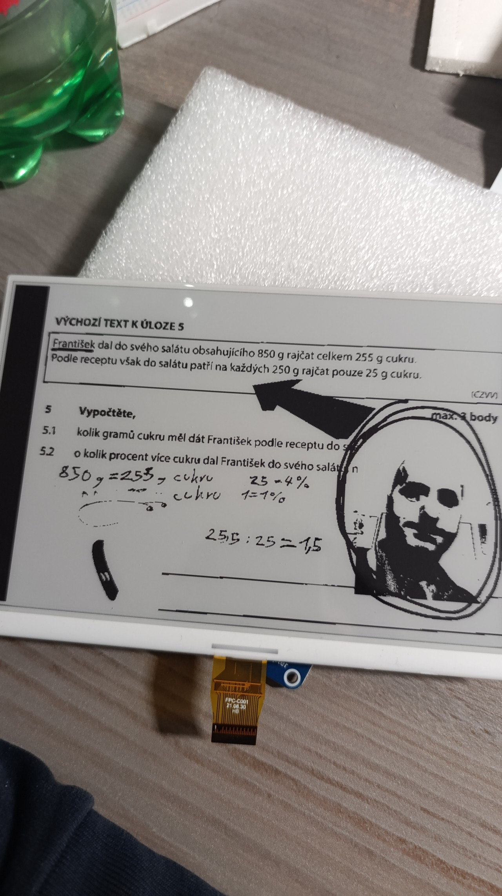
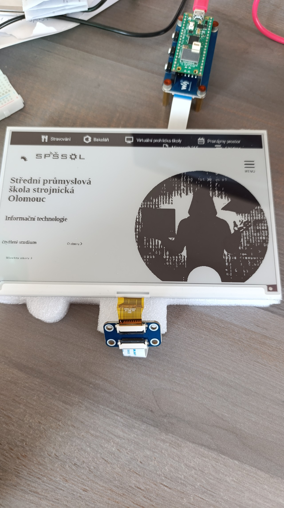
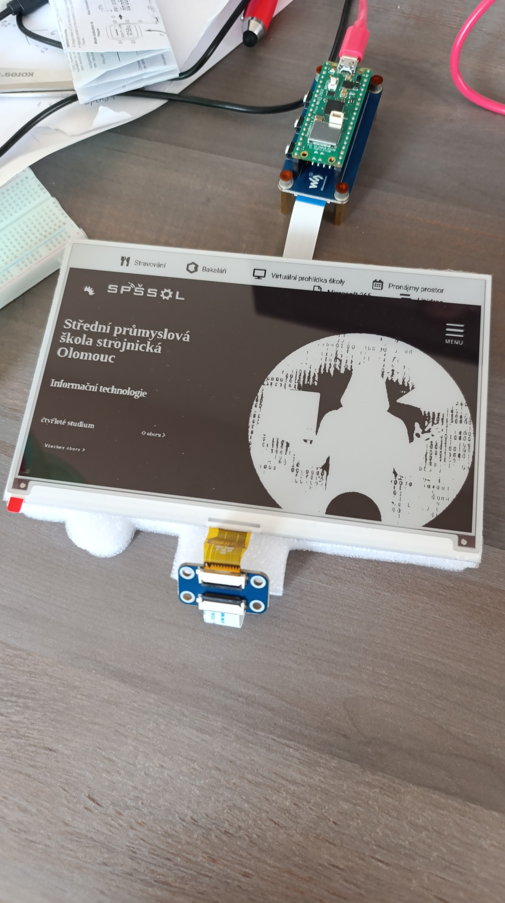
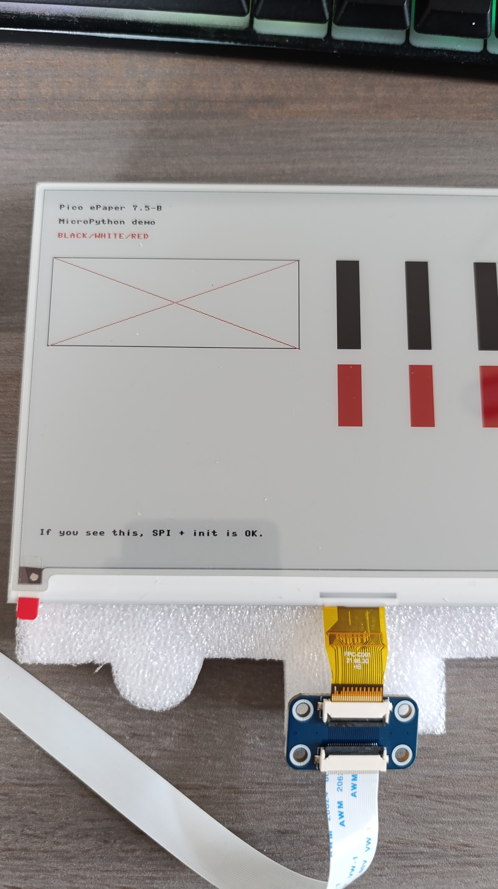

# Pico Kiosk

Pico Kiosk je systém pro zobrazení webového obsahu na e-ink displeji pomocí Raspberry Pi Pico W. 
[dokumentace displeje](https://www.waveshare.com/wiki/Pico-ePaper-7.5-B)  
Backend automaticky renderuje HTML šablonu přes Puppeteer a převádí ji na optimalizovaný binární obraz.
Tento proces umožňuje snadnou správu informačních panelů s minimálními nároky na hardware mikrokontroléru.

